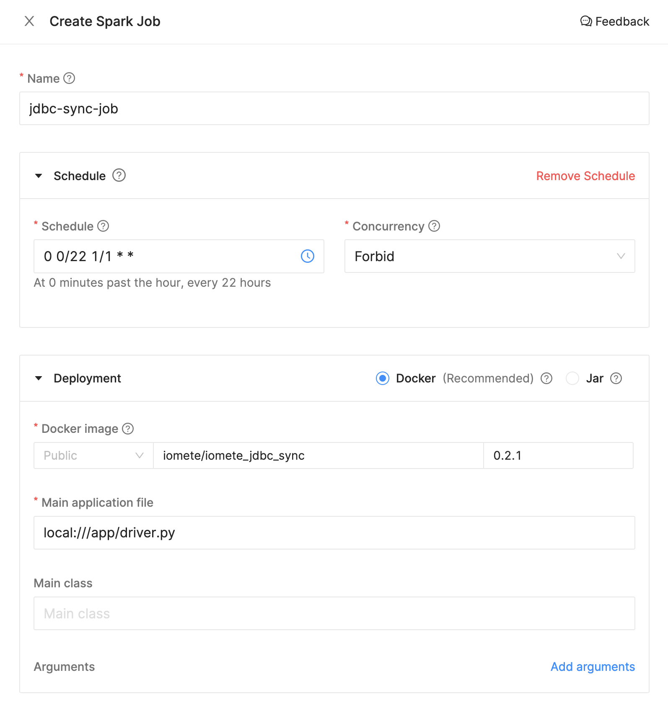

# iomete: JDBC Sync

This library provides easily replicate tables from JDBC databases (MySQL, PostgreSQL, etc.) to iomete

> **Note**: It requires you have SSH Tunnel between iomete if your database in a private network (see: https://docs.iomete.com/docs/database-connection-options)


## Deployment

- Go to `Spark Jobs`.
- Click on `Create New`.

Specify the following parameters (these are examples, you can change them based on your preference):
- **Name:** `jdbc-sync-job`
- **Schedule:** `0 0/22 1/1 * *`
- **Docker Image:** `iomete/iomete_jdbc_sync:0.1.4`
- **Main application file:** `local:///app/driver.py`
- **Config file:** 
```hocon
{
  "source_connection": {
    "type": "mysql",
    "host": "iomete-tutorial.cetmtjnompsh.eu-central-1.rds.amazonaws.com",
    "port": "3306",
    "username": "tutorial_user",
    "password": "9tVDVEKp"
  },
  "source_schema": "employees",
  "destination_schema": "employees_raw",
  "syncs": [
    {
      "table_names": ["departments"],
      "sync_mode": {
        "type": "full_load"
      }
    },
    {
      "table_names": ["dept_emp"],
      "sync_mode": {
        "type": "incremental_snapshot",
        "identification_column": "id",
        "tracking_column": "updated_at"
      }
    }
  ]
}
```
> **Note**: `updated_at` column does not exist in `dept_emp` table. We put it just for example. First time you run job, there will not be any problem. Because first time job will load full data. But if you run job second time job will throw exception (`cannot resolve 'updated_at' given input columns`)

Create Spark Job


Create Spark Job - Application Config


And, hit the create button.

---
The job will be run based on the defined schedule. But, you can trigger the job manually by clicking on the `Run` button.


## Configuration properties
<table>
  <thead>
    <tr>
      <th>Property</th>
      <th>Description</th>
    </tr>
  </thead>

  <tbody>
    <tr>
      <td>
        <code>source_connection</code><br/>
      </td>
      <td>
        <p>Required properties to connect  source.</p>
        <ul>
          <li><code>type</code> your database type like Mysql, Postgres, etc.</li>
          <li><code>host</code> your database host. Example: iomete-tutorial.cetmtjnompsh.eu-central-1.rds.amazonaws.com</li>
          <li><code>port</code> port number. Example: 3306</li>
          <li><code>username</code> database username</li>
          <li><code>password</code> database password</li>
        </ul>
      </td>
    </tr>
    <tr>
      <td>
        <code>source_schema</code><br/>
      </td>
      <td>
        <p><code>source_schema</code> is where your tables stored.</p>
      </td>
    </tr>
    <tr>
      <td>
        <code>destination_schema</code><br/>
      </td>
      <td>
        <p>Your tables will store under <code>destination_schema</code> in your Warehouse at <strong>iomete</strong>.</p>
      </td>
    </tr>
    <tr>
      <td>
        <code>syncs</code><br/>
      </td>
      <td>
        <table>
          <tbody>
            <tr>
              <td>
                <code>table_names</code>
              </td>
              <td>
                <p>List of tables which you want to replicate</p>
              </td>
            </tr>
            <tr>
              <td>
                <code>sync_mode</code>
              </td>
              <td>
                You can choose sync mode. Full load or incremental
                <ul>
                  <li><code>full_load</code></li>
                  <li><code>incremental_snapshot</code>
                    <ul>
                      <li><code>identification_column</code></li>
                      <li><code>tracking_column</code></li>
                    </ul>
                  </li>
                </ul>
                [Read more about sync mode](#sync-mode)
              </td>
            </tr>
          </tbody>
        </table>
      </td>
    </tr>
</tbody>
</table>

## Sync mode

You can define sync mode for each table. Currently, supported sync modes are:

- `FullLoad`: Read everything in the source and overwrites whole table at the destination at each sync
- `IncrementalSnapshot`: It creates the snapshot of table in the destination and only move the newly inserted and
  updated records. While writing to iomete it uses merge statement. This mode requires 2
  parameters: `identification_column` will be used on merge statement, and `tracking_column` to track the where it
  should continue to get data from the source table

## Development

**Prepare the dev environment**

```shell
virtualenv .env #or python3 -m venv .env
source .env/bin/activate

pip install -e ."[dev]"
```

**Run test**

```shell
pytest
```